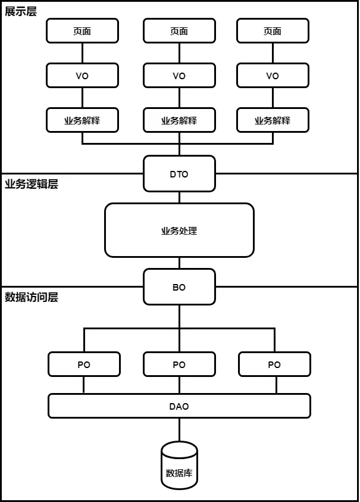

- 日期：2025-06-23

|名称|作用|特点|例子|常见位置|
|--|--|--|--|----|
|VO (View Object) 视图对象|展示层需要展示的数据。|- VO与DTO的属性值基本相同，但是VO是DTO的最终解释，可以对DTO的字段进行适当删减。 - 不一定与数据库一一对应|VO主要的存在形式就是js里面的对象||
|DTO (Data Transfer Object) 数据传输对象|展示层与服务层之间的数据传输对象。||||
|BO (Business Object) 业务对象|用于封装业务逻辑处理中的中间数据结构。||简单的例子比如说PO是一条交易记录，BO是一个人全部的交易记录集合对象。 复杂点儿的例子PO1是交易记录，PO2是登录记录，PO3是商品浏览记录，PO4是添加购物车记录，PO5是搜索记录，BO是个人网站行为对象 BO是一个业务对象，一类业务就会对应一个BO，数量上没有限制，而且BO会有很多业务操作，也就是说除了get，set方法以外，BO会有很多针对自身数据进行计算的方法 来自 <[https://zhuanlan.zhihu.com/p/102389552](https://zhuanlan.zhihu.com/p/102389552)\> ||
|PO (Persistent Object) 持久化对象|数据库实体， ORM映射|- PO就是数据库中的记录，一个PO的数据结构对应着库中表的结构，表的一条记录就是一个PO对象|||
|DO (Domain Object / Data Object) 领域对象||现在主要是两个版本 - 一个是阿里巴巴的开发手册中的定义，DO(Data Object)这个等同于上面的PO - 另一个是DDD(Domin-Driven Design)领域驱动设计中，DO(Domain Object)这个等同于上面的BO
|||

